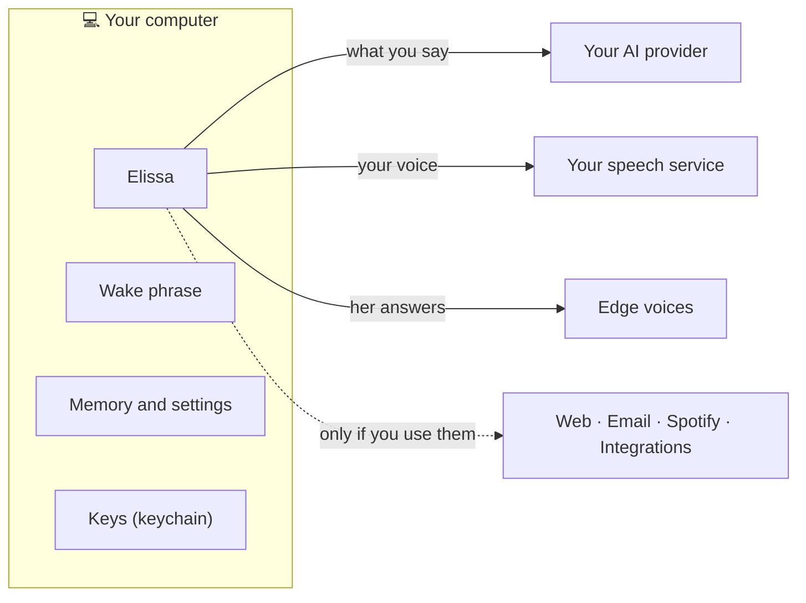

```mermaid
flowchart LR
  subgraph PC["💻 Your computer"]
    E["Elissa"]
    W["Wake phrase"]
    M["Memory and settings"]
    K["Keys (keychain)"]
  end
  E -- what you say --> AI["Your AI provider"]
  E -- your voice --> STT["Your speech service"]
  E -- her answers --> TTS["Edge voices"]
  E -. only if you use them .-> X["Web · Email · Spotify · Integrations"]
```

<small>Each arrow goes only to the service you chose, and each one can be avoided: see the table below.</small>

--8<-- "PRIVACY.md"
