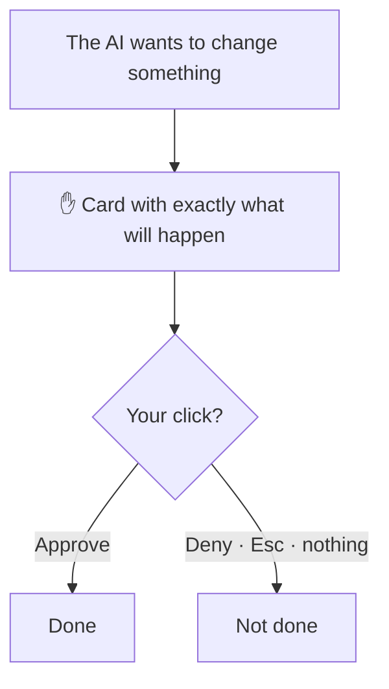

<figure class="shot" markdown>

</figure>

```mermaid
flowchart TB
  A["The AI wants to change something"] --> B["✋ Card with exactly what will happen"]
  B --> C{"Your click?"}
  C -- Approve --> D["Done"]
  C -- "Deny · Esc · nothing" --> E["Not done"]
```

--8<-- "SECURITY.md"
